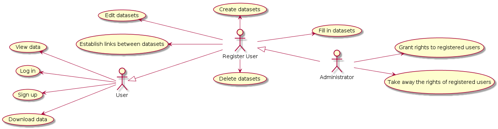

# Запити зацікавлених осіб

&nbsp;
>1. Мета
>2. Короткий огляд продукту
>3. Контекст
>4. Ділові правила
>>   - 4.1. Призначення системи
>>   - 4.2. Політика взаємовідносин з клієнтом
>>   - 4.3. Характеристика ділового процесу
>>   - 4.4. Сценарії
>>  - 4.4.1. Сценарій пошуку користувачем інформації про погоду.

>5. Функціональність
>>   - 5.1. Структура облікового запису сайту
>>   - 5.2. Можливості користувачів
>6. Практичність
>>   - 6.1. Стандартизація &nbsp;

>7. Надійність
>>    - 7.1. Забезпечення захищеного з’єднання(Використання протоколу HTTPS)
>>    - 7.2. Резервне копіювання та відновлення даних
>>    - 7.3. Віддалене зберігання даних
&nbsp;
### Вступ
>&nbsp;&nbsp;У цьому документі описуються запити зацікавлених осіб по відношенню
>до розроблювальної системи “SystemX” в якості яких виступають: користувач,
>зареєстрований користувач, адміністратор, розробники.
### 1. Мета
>&nbsp; &nbsp; Метою документу є визначення основних вимог до функціональності, 
>продуктивності, доступності, зручності, а також: визначення бізнес-правил та
> технологічних обмежень, що накладаються на систему “SystemX”.

### 2. Короткий огляд продукту
>&nbsp;&nbsp;Команда розробників має на меті створити сервіс “SystemX”.
Система “SystemX” надає веб-сервіс для створення сутностей,
> атрибутів, data-point, для визначення типу data-point, створення 
>зв’язків між різними dataset. Користувач має можливість отримати 
>інформацію з будь-якого dataset в різних форматах csv, pdf, json, 
>xml. Також система надає сервіс для графічного представлення даних(графіки, діаграми)
> та свою REST full API.

| Формати даних | Користувач |
| ------ | ------ |
| csv | + |
| pdf | + |
| json | + |
| графіки, діаграми | + |
| REST full Api | + |

### 3. Контекст
>&nbsp;&nbsp;Перелік вимог, зазначених у даному документі є основою технічного завдання для розробки системи “SystemX”.

### 4. Ділові правила

##### 4.1 Призначення системи

>&nbsp; &nbsp;Система “SystemX” надає користувачам для перегляду будь-які dataset, надає можливість перегляду візуального представлення даних у графіках та діаграмах також надає можливість отримання даних в зручному для нього форматі csv, pdf, json, xml.

##### 4.2 Політика взаємовідносин з клієнтом

>   Нижче перераховані означення клієнтів:
&nbsp;&nbsp;  
>
>- **1.** **Користувач** - це особа, яка має доступ до функціональності сервісу. Він може переглядати дані з будь-якого dataset та їх візуальне представлення, також він має можливість завантажити дані в будь-якому з форматів csv, pdf, json, xml.
>- **2.** **Зареєстрований користувач** - це особа, яка створює, видаляє та редагує dataset, встановлює зв’язки між ними також наповнює їх даними.
>- **3.** **Адміністратор** - це особа, завданням, якої є надавання прав на створення, редагування і встановлення зв'язків між між різними dataset зареєстрованим користувачам відносно dataset.

##### 4.3 Характеристика ділового процесу

>- **Користувач** для того, щоб отримати інформацію про dataset, повинен здійснити пошук dataset за назвою через пошуковий рядок або через пошукові фільтри та обрати інформацію, котра його цікавить за наданими результатами пошуку.
>- **Зареєстрований користувач**, - щоб отримати доступ до адміністративної панелі системи,
>має авторизуватися. Щоб наповнити dataset інформацією, необхідно обрати потрібний dataset; після введення всіх необхідних даних - натиснути кнопку “Відправити”. Для створення dataset потрібно перейти до панелі створення і за допомогою інструментів сервісу визначити всі entity та створити зв’язки між ними та зв’язки з іншими dataset і зберегти, натиснувши кнопку “Зберегти”
> - **Адміністратор**, - щоб отримати доступ до адміністративної панелі системи, має авторизуватися. Для надання прав зареєєстрованому користувачу необхідно вибрати потрібного користувача та dataset (відносно якого будуть встановлюватися права) і за допомогою інструментів адміністративної панелі визначити права та зберегти натиснувши кнопку "Зберегти".  

##### 4.4 Сценарії

###### 4.4.1 Сценарій пошуку  Користувачем інформації.

>**Учасники**: користувач, система.
Передумова: немає.
Результат: користувач отримав необхідну йому інформацію.
&nbsp;
>>- &nbsp; **1.** Користувач вводить повну або скорочену назву dataset.
>>- &nbsp; **2.** Користувач налаштовує пошукові фільтри та натискає кнопку “Пошук”.
>>- &nbsp; **3.** Система надає пошукові результати.
>>- &nbsp; **4.** Серед наведених результатів користувач обирає потрібний.
>>- &nbsp; **5.** Система надає інформацію в потрібному користувачеві форматі.
>
>Виключні ситуації:
>
>>	немає.

###### 4.4.2 Сценарій заповнення Зареєстрованим користувачем dataset.

>**Учасники**: зареєєстрований користувач, система.
>
>Передумова: сеанс роботи зареєєстрованого користувача організовано.
>
>Результат: заповнений dataset.
>>- &nbsp; **1.** Зареєєстрований користувач здійснює пошук необхідного йому dataset за допомогою пошукового рядка або пошукових фільтрів.
>>- &nbsp; **2.** Система надає результати пошукового запиту.
>>- &nbsp; **3.** Зареєєстрований користувач обирає dataset для заповнення.
>>- &nbsp; **4.** Система відкриває обраний dataset.
>>- &nbsp; **5.** Зареєєстрований користувач заповнює dataset.
>>- &nbsp; **6.** Зареєєстрований користувач натискає кнопку “Зберегти”.
>>- &nbsp; **7.** Система повідомляє про успішне збереження даних.
>
>Виключні ситуації:
>
>> - **1.** Невідповідність даних типам даних представлених у dataset.

###### 4.4.3 Сценарій створення Зареєстрованим користувачем dataset.

> **Учасники:** зареєєстрований користувач, система.
>
>Передумова: сеанс роботи зареєєстрованого користувача організовано.
>
>Результат: створений dataset.
>>- &nbsp; **1.** Зареєєстрований користувач натискає кнопку створити dataset.
>>- &nbsp; **2.** Система надсилає форму для створення dataset.
>>- &nbsp; **3.** Зареєєстрований користувач заповнює форму та встановлює зв’язки.
>>- &nbsp; **4.** Зареєєстрований користувач натискає кнопку “Зберегти”.
>>- &nbsp; **5.** Система надсилає повідомлення про успішне збереження.
>
>Виключні ситуації:
>
>> - Немає.

###### 4.4.4 Сценарій реєстрації Користувача.

>**Учасники:** користувач, система.
>
>Передумова: немає.
>
>Результат: аккаунт зареєстровано.
>>- &nbsp; **1.** Користувач натискає кнопку “Реєстрація”.
>>- &nbsp; **2.** Система надсилає йому форму із наступними полями:
>>>      a) логін
>>>      b) пароль
>>>      c) електронна адреса
>>- &nbsp; **3.** Користувач натискає кнопку “Зареєструватись”.
>>- &nbsp; **4.** Система надсилає повідомлення на електронну пошту повідомлення із кодом підтвердження.
>>- &nbsp; **5.** Система надає форму для введення коду.
>>- &nbsp; **6.** Користувач вводить код для підтвердження та натискає кнопку “Підтвердити”.
>>- &nbsp; **7.** Система повідомляє про успішну реєстрацію.
>
>Виключні ситуації:
>
>**1.** Кнопка “Відміна”
>
>>- Дана кнопка використовується при помилці, щоб закрити форму реєстрації.

###### 4.4.5 Сценарій реєстрації наддання прав користувачу.
>**Учасники:** адміністратор, система.
>
>Передумова: сеанс роботи адміністратора встановленно.
>
>Результат: права зареєстрованому користувачу надано.
>>- &nbsp; **1.** Адміністратор натискає кнопку “Обрати користувача”.
>>- &nbsp; **2.** Система надсилає список зареєстрованих користувачів.
>>- &nbsp; **3.** Адміністратор обирає зареєстрованого користувача із списку.
>>- &nbsp; **4.** Система надсилає список dataset.
>>- &nbsp; **5.** Адміністратор обирає необхідний dataset.
>>- &nbsp; **6.** Система надсилає список прав.
>>- &nbsp; **7.** Адміністратор обирає необхідні права.
>>- &nbsp; **8.** Адміністратор натискає кнопку "Зберегти".
>>- &nbsp; **9.** Система повідомляє про надання прав зареєстрованому користувачу.
>
>Виключні ситуації:
>
>**1.** Кнопка “Відміна”
>
>>- Дана кнопка використовується при помилці, щоб закрити форму надання прав.

###### 4.4.6 Сценарій реєстрації наддання прав користувачу відносно dataset.
>**Учасники:** адміністратор, система.
>
>Передумова: сеанс роботи адміністратора встановленно.
>
>Результат: права зареєстрованому користувачу надано.
>>- &nbsp; **1.** Адміністратор натискає кнопку “Обрати dataset”.
>>- &nbsp; **2.** Система надсилає список dataset.
>>- &nbsp; **3.** Адміністратор обирає dataset із списку.
>>- &nbsp; **4.** Система надсилає список зареєєстрованих користувачів.
>>- &nbsp; **5.** Адміністратор обирає необхідного користувача.
>>- &nbsp; **6.** Система надсилає список прав.
>>- &nbsp; **7.** Адміністратор обирає необхідні права.
>>- &nbsp; **8.** Адміністратор натискає кнопку "Зберегти".
>>- &nbsp; **9.** Система повідомляє про надання прав зареєстрованому користувачу.
>
>Виключні ситуації:
>
>**1.** Кнопка “Відміна”
>
>>- Дана кнопка використовується при помилці, щоб закрити форму надання прав.

### 5. Функціональність

>Основні вимоги до функціональності, пред’явлені зацікавленими особами, відносяться до двох категорій:
&nbsp; **1.**  Користувач;
&nbsp; **2.** Зареєстрований користувач;
&nbsp; **3.**  Адміністратор

##### 5.1 Можливості Зареєстрованого користувача

>- &nbsp; **1.**  Заповнення dataset.
>- &nbsp; **2.**  Редагування dataset.
>- &nbsp; **3.** Створення dataset.
>- &nbsp; **4.** Редагування dataset.
>- &nbsp; **5.** Видалення dataset.
>- &nbsp; **6.** Встановлення зв’язків між dataset.

##### 5.1 Можливості Адміністратора 

>- &nbsp; **1.**  Додавати права користувачу .
>- &nbsp; **2.**  Видаляти права користувачу.
>- &nbsp; **3.**  Змінювати права користувачу

### 6. Практичність

##### 6.1. Стандартизація
>Сайт має коректно відображатись у найбільш популярних браузерах(Opera, Chrome, Mozilla…).

### 7. Надійність

##### 7.1 Забезпечення захищеного з’єднання (використання протоколу HTTPS).
##### 7.2 Резервне копіювання та відновлення даних
>	Обов’язково має здійснюватися резервне копіювання бази даних.
>
##### 7.3 Віддалене зберігання даних

#### Діаграма Usecase :

#### Діаграми послідовності

##### Сценарій 4.4.1

##### Сценарій 4.4.2

##### Сценарій 4.4.3

##### Сценарій 4.4.4

##### Сценарій 4.4.5

##### Сценарій 4.4.6

